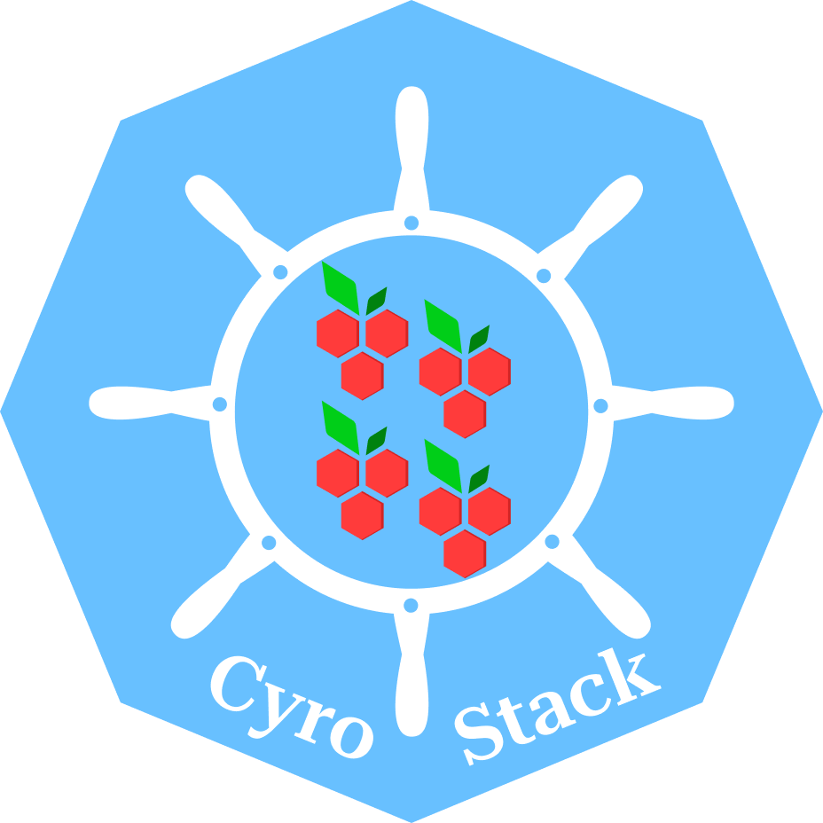
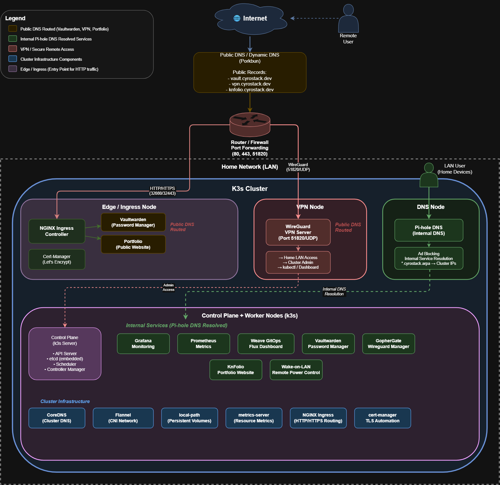

<!-- Project Shields -->

[](https://github.com/Cyrof/CyroStack/stargazers)
[](https://github.com/Cyrof/CyroStack/issues)
[](https://github.com/Cyrof/CyroStack/blob/main/LICENSE)
[](https://www.linkedin.com/in/keithnks)

<br />

<div align="center">
  <a href="https://github.com/Cyrof/CyroStack">
    
  </a>

  <h3 align="center">CyroStack</h3>

  <p align="center">
    My self-hosted Raspberry Pi Kubernetes homelab platform.
    <br />
    <strong>k3s · Flux · NGINX Ingress · cert-manager · Pi-hole · WireGuard · Monitoring</strong>
    <br />
    <br />
    <a href="#about-the-project"><strong>Explore the docs »</strong></a>
    <br />
    <br />
    <a href="#cluster-architecture">Architecture</a>
    &middot;
    <a href="#node-layout">Node Layout</a>
    &middot;
    <a href="#active-services">Services</a>
  </p>
</div>

---

## About The Project

**CyroStack** is my personal self-hosted Raspberry Pi Kubernetes homelab platform.

This repository documents and manages the platform-level infrastructure for my home k3s cluster, including:

- cluster bootstrap and node preparation
- Kubernetes infrastructure components
- ingress routing
- TLS certificate automation
- internal DNS
- VPN access
- monitoring
- GitOps-managed services
- self-hosted application deployment references

The purpose of this repository is to keep my homelab infrastructure reproducible, organized, and easier to maintain.

Application source code is usually kept in separate repositories. This repository mainly focuses on the infrastructure and deployment layer.

---

## Cluster Architecture

The diagram below shows the current high-level architecture of CyroStack.

It includes the public DNS flow through Porkbun, router port forwarding, the k3s cluster layout, edge ingress routing, internal Pi-hole DNS resolution, WireGuard VPN access, and the main internal services running inside the cluster.

<p align="center">
  
</p>

---

## Node Layout

> IP addresses are partially masked intentionally.

| Node   | IP Address      | Role                   |
| ------ | --------------- | ---------------------- |
| Node 1 | `xxx.xxx.xxx.1` | Control Plane / Master |
| Node 2 | `xxx.xxx.xxx.2` | Edge / Ingress Node    |
| Node 3 | `xxx.xxx.xxx.3` | DNS Node / Pi-hole     |
| Node 4 | `xxx.xxx.xxx.4` | VPN Node / WireGuard   |
| Node 5 | `xxx.xxx.xxx.5` | Worker Node            |
| Node 6 | `xxx.xxx.xxx.6` | Worker Node            |
| Node 7 | `xxx.xxx.xxx.7` | Worker Node            |

---

## Active Services

### Public Services

These services are publicly reachable through Porkbun DNS and routed into the cluster through the Edge / Ingress Node.

| Service     | Description                      | Domain                  |
| ----------- | -------------------------------- | ----------------------- |
| Vaultwarden | Self-hosted password manager     | `vault.cyrostack.dev`   |
| KnFolio     | Portfolio website                | `knfolio.cyrostack.dev` |
| WireGuard   | VPN access into the home network | `vpn.cyrostack.dev`     |

---

### Internal Services

These services are intended for LAN or VPN access only.

| Service      | Description                    |
| ------------ | ------------------------------ |
| Grafana      | Monitoring dashboards          |
| Prometheus   | Metrics collection             |
| Weave GitOps | Flux dashboard                 |
| GopherGate   | WireGuard management dashboard |
| Wake-on-LAN  | Remote power control           |
| Pi-hole      | Internal DNS and ad-blocking   |

---

### Cluster Infrastructure

Core infrastructure components running in the k3s cluster.

| Component                | Purpose                        |
| ------------------------ | ------------------------------ |
| CoreDNS                  | Kubernetes internal DNS        |
| Flannel                  | k3s CNI networking             |
| local-path-provisioner   | Persistent volume provisioning |
| metrics-server           | Kubernetes resource metrics    |
| NGINX Ingress Controller | HTTP/HTTPS ingress routing     |
| cert-manager             | TLS certificate automation     |
| Flux                     | GitOps reconciliation          |

---

## Repository Structure

```bash
.
├── ansible-configs
├── archive
├── assets
├── cert-manager
├── clusters
├── gophergate-deploy
├── LICENSE
├── nginx
├── porkbun-dns-updater
├── portfolio
├── README.md
└── wakeonlan
```

---

## Directory Overview

### `ansible-configs/`

Ansible playbooks and roles for node preparation, base OS configuration, and cluster-related automation.

### `nginx/`

NGINX Ingress Controller configuration for routing HTTP and HTTPS traffic into the cluster

### `cert-mangaer/`

cert-manager configuration for TLS ceritifcate automation

### `flux/`

Flux GitOps configuration for reconciling Kubernetes resources from this repository.

### `porkbun-dns-updater/`

Dynamic DNS updater for Porkbun.

This keeps public DNS records updated when the home public IP changes.

### `portfolio/`

Deployment configuration for my portfolio website.

This application source code itself may live in a separate repository.

### `archive/`

Old, unused, paused, or experimental components.

Nothing inside `archive/` is considered active.

---

## GitOps Workflow

CyroStack uses Flux for GitOps-based deployment.

```bash
Git commit
  ↓
Push to GitHub
  ↓
Flux detects changes
  ↓
Flux reconciles cluster state
  ↓
k3s applies the desired configuration
```

This keeps the cluster state aligned with the repository and reduces manual changes on the cluster.

---

## Cloning This Repository

This repository may use git submodules.

Clone with:

```bash
git clone --recurse-submodules https://github.com/Cyrof/CyroStack.git
```

If the repository was already cloned without submodules:

```bash
git submodule update --init --recurse
```

---

## License

Distrubuted under the Unlicence License. See [LICENSE](#license) for more information.
